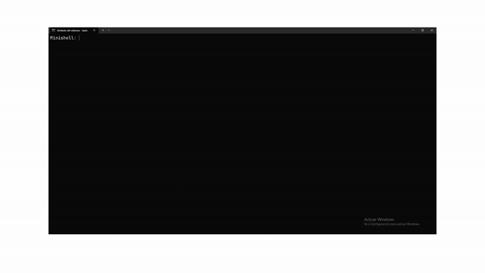

# **Minishell: Creación de un Intérprete de Comandos**

Este proyecto representa uno de los desafíos fundamentales de la escuela 42: el desarrollo de un intérprete de comandos (una "shell") partiendo desde cero. En esencia, el objetivo es recrear una versión simplificada del `Terminal` de macOS o la `Línea de Comandos` de Windows, programas que permiten a los usuarios interactuar directamente con el sistema operativo.

La finalización de Minishell demuestra un profundo conocimiento sobre el funcionamiento interno de los sistemas operativos tipo UNIX/Linux y una gran capacidad para gestionar problemas complejos de programación.

---

## **✅ Capacidades y Funcionalidades Desarrolladas**

Más que una simple lista de funciones, este proyecto demuestra la capacidad de implementar un sistema robusto con las siguientes características clave:

* **Interpretación y Ejecución de Comandos**: Capacidad para procesar las órdenes del usuario y ejecutar programas del sistema, actuando como un verdadero puente entre el usuario y el sistema operativo.
* **Gestión Avanzada de Procesos**:
    * **Pipes (`|`)**: Implementación de la funcionalidad de "tuberías", que permite encadenar comandos para que la salida de uno se convierta en la entrada del siguiente. Esto es clave para realizar tareas complejas de forma eficiente.
    * **Redirecciones (`>`, `>>`, `<`)**: Manejo del flujo de datos, permitiendo guardar la salida de un comando en un archivo o utilizar un archivo como fuente de entrada.
* **Desarrollo de Comandos Integrados**: Creación de comandos esenciales propios de la shell, como `cd` para navegar entre carpetas, `pwd` para saber la ubicación actual, `echo` para imprimir texto, `export` para gestionar variables y `exit` para terminar la sesión.
* **Manejo de Variables de Entorno**: Capacidad para interpretar y expandir variables del sistema (ej. `$HOME` o `$PATH`), una característica fundamental para la personalización y el funcionamiento de la shell.
* **Robustez y Experiencia de Usuario**: Gestión sólida de errores de sintaxis y de señales del sistema (como `Ctrl+C` para cancelar un comando), garantizando un programa estable y fiable para el usuario.

---

## **🛠️ Tecnologías y Habilidades Aplicadas**

* **Lenguaje de Programación**: El proyecto fue desarrollado íntegramente en **Lenguaje C**, lo que demuestra un sólido dominio de la programación a bajo nivel, la gestión manual de memoria y las llamadas al sistema.
* **Entorno Técnico**: Uso de librerías estándar de sistemas UNIX/Linux para interactuar directamente con las funcionalidades del sistema operativo (gestión de procesos, archivos y señales).
* **Calidad y Estándares de Código**: Adherencia estricta a la normativa de codificación **Norminette** de 42, lo que asegura un código limpio, legible, bien estructurado y fácil de mantener.

---

## **🏆 ¿Qué demuestra la finalización de este proyecto?**

Completar Minishell es una prueba tangible de las siguientes competencias:

* **Resolución de Problemas Complejos**: Capacidad para analizar, diseñar y construir un programa complejo desde sus cimientos.
* **Conocimiento de Sistemas Operativos**: Comprensión profunda de la gestión de procesos, flujos de datos y memoria a nivel de sistema.
* **Programación Rigurosa**: Habilidad para escribir código eficiente y robusto en un lenguaje de bajo nivel como C.
* **Autonomía y Disciplina**: Competencia para llevar a cabo un proyecto de gran envergadura siguiendo especificaciones técnicas y estándares de calidad exigentes.
